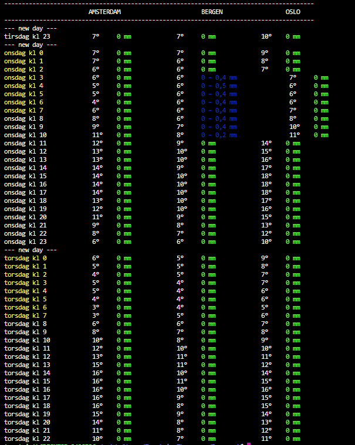

# Python webscraper

## fwebscraper:
This scrape the yr.no page for the weather forecast
You need to use Python 2 (To make the print syntax working)


Run:
```python fwebscraperAll.py ```




### optional 
By default the city is 'Amsterdam'

```python fwebscraper.py``` or ```python fwebscraper.py ams``` or ```python fwebscraper.py amsterdam```

This will return the weather for Amsterdam

```python fwebscraper.py be``` or ```python fwebscraper.py bergen```

Will return the weather for Bergen

```python fwebscraper.py os``` or ```python fwebscraper oslo```

will return the weather for Oslo

## SwitchScraper
Gets the price for Nintendo Switch on netonnet.no

```python SwitchScraper.py```


> How you enjoy this and see how easy it is to use webscraper
- Torstein
